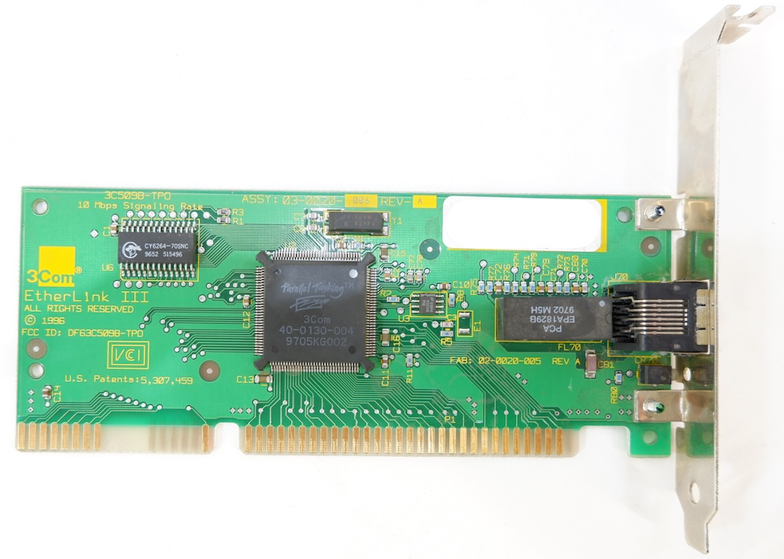
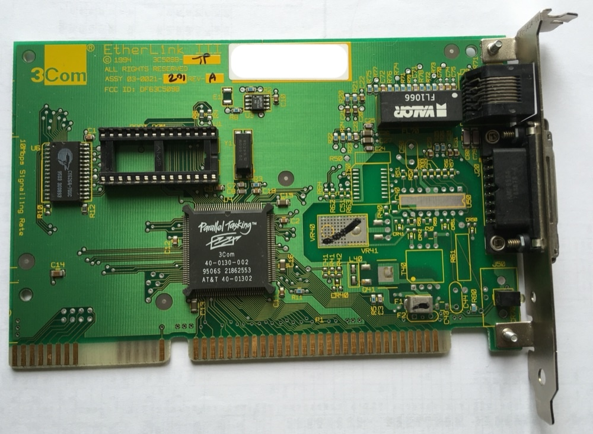

# Sprinter 3C509B Network Kit

A polling-only network stack and utility set for Sprinter DSS, targeting the
3Com EtherLink III 3C509B (TPO and TP boards) in a Sprinter ISA slot. It doubles as a
development kit: the driver, the TCP transport and `UNET509B.DLL` are meant to
be reused by other Sprinter DSS programs.

The card is driven entirely by status polling: the driver never uses ISA
interrupts and never programs one into the card. There is therefore no IRQ
setting anywhere in the kit, and every wait loop is bounded and returns an
explicit status code on expiry.
EEPROM access is read-only: nothing here ever reprograms a card.

`specs.md` is the authoritative specification, staged roadmap and acceptance
log. Repository conventions are in `CLAUDE.md` / `AGENTS.md`.

## Attribution

Sprinter 3C509B Network Kit project author:

- Dmitry Mikhalchenkov, FidoNet: 2:5030/1997.10

Licensing and third-party components are covered in `LICENSE` and
`THIRD_PARTY.md`.

## Status

Version 0.1.3. The release archive carries the end-user utilities:

- **Setup and diagnostics:** `EL3INFO` (read-only discovery), `NETCFG`
  (transactional `NET_*` environment), `IFUP` (static, DHCP acquire, renew and
  release).
- **Network clients:** `PING`, `NSLOOKUP`, `NTP` (sets the DSS clock), `TFTP`
  (GET/PUT with hostnames), `WGET` (HTTP/1.0 with redirects and `-r` resume),
  `FTP` (passive mode; download, upload, `LIST` and `NLST`), `TELNET`
  (ANSI/VT100 with Zmodem, Ymodem and Ymodem-G).
- **`UNET509B.DLL`:** a libman 1.3 / L1 loadable backend exposing the stack to
  third-party programs through the same numbered API the sibling RTL8019AS and
  Wi-Fi kits implement, so one consumer binary can drive any of them. It covers
  TCP (connect, listen, blocking and non-blocking send), UDP, DNS resolution
  and ping over two independent channels. See `docs/UNET509B.md`.

The bring-up and measurement programs — `HELLO`, `EL3EEP`, `EL3REG`, `EL3LB`,
`EL3TX`, `EL3RX`, `ISAPROBE`, `ARP`, `PINGALT`, `UDPTEST`, `TCPTEST`,
`DLSPEED`, `DLDIRECT`, `NETPROF` and `UNETTEST` — are built and copied to the
floppy image but stay out of the release archive; see `tools/artifacts.sh`.

A host-side harness runs the real built `.EXE` files under a Z80 / DSS / ISA /
3C509B model with no emulator boot, via `make test-host`. It is a mandatory
step of every code change.

## Supported cards

The driver is written against the 3C509B EEPROM layout, not one single board.
Discovery reads the EEPROM through the ID port and requires **all** of: a
recognized product ID, the 3Com manufacturer ID `0x6D50`, a valid unicast MAC,
and both EEPROM checksums. Two boards have answered that end to end:

| Card | Product ID | Media | `NET.CFG` |
|------|-----------|-------|-----------|
| 3Com EtherLink III 3C509B-TPO | `0x9550` | RJ-45, 10BASE-T half duplex | none (`HW=AUTO`) |
| 3Com EtherLink III 3C509B-TP  | `0x9050` | RJ-45, 10BASE-T half duplex (also populates a 15-pin AUI connector, unused) | none (`HW=AUTO`) |

The two boards' EEPROM images are otherwise built the same way and their
media/config words (`08`/`09`/`0D`) agree: both ship configured for the TP
transceiver, which is the only media path this driver implements (see below),
so accepting the second product ID needed no change to `el3_regs.asm`.

3C509B-TPO, 10 Mbps signalling rate, RJ-45 only, FCC ID `DF63C509B-TPO`, with
the Parallel Tasking ASIC `40-0130-004` in the middle of the board — assembly
`03-0020-002` rev 3, the one verified end to end on a real Sprinter, in
physical slot 0 at ID port `#110`:



3C509B-TP, assembly `03-0021-201` rev A, FCC ID `DF63C509B`, with the same
Parallel Tasking ASIC (`40-0130-002`), an RJ-45 jack and a populated 15-pin AUI
D-sub below it, no BNC:



Note both boards carry a full 16-bit ISA edge connector while Sprinter's slot
drives only the first, 8-bit section. That is exactly how the kit is meant to
run: every 16-bit card register is accessed as two adjacent byte cycles, low
byte first, with no other card access allowed in between, and the FIFO is read
and written only through the low port.

### Other EtherLink III variants

A board whose EEPROM reports neither `0x9550` nor `0x9050` is **not**
supported: discovery stops at the first check with `RESULT FAIL code=3` rather
than misconfiguring a card it does not understand. This includes a true Combo
or BNC-only board even if its product ID happened to match one of the two
above, because this driver never selects a transceiver: the coax transceiver
needs the Start Coax / Stop Coax commands and their settling delays, and AUI
needs its own Window 4 media selection, and neither is implemented here — only
the TP media setup (link beat and jabber protection) is. A 3C509B-TP's unused
AUI port is exactly this case: present in hardware, never driven. The ID check
lives in `src/lib/el3_algorithms.asm` (`VALIDATE`), the TP media setup in
`src/lib/el3_regs.asm`, and `docs/STAGE1_AUDIT.md` records which commands are
deliberately unimplemented.

Multiple 3Com cards in one ISA segment are also out of scope for version 1:
the kit activates exactly one selected adapter.

### When the card is not found

`EL3INFO` is the instrument for this, and it is read-only:

```text
EL3INFO -s 0 -p #110 -b AUTO
EL3INFO -v
```

`-s` is the physical ISA slot, `0` or `1`, default `1`; `-p` the ID port,
`#100..#1F0` on a 16-byte boundary, default `#110`; and `-b` an I/O base,
`#200..#3E0` on a 16-byte boundary, which overrides the EEPROM value for this
activation only and is never written back.

Failures are stable and distinguishable. Code 3 is card/ID not found, and an
empty slot reads every EEPROM word as `FFFF`. Code 5 is an EEPROM checksum
failure, which already proves the card answers and that the ID port, bus
timing and ISA window are healthy. Record the card label, slot and ID port
before testing, start with `EL3INFO`, and never blind-scan ISA space.
`docs/HOWTO.md` covers the safe setup sequence.

## Installing on Sprinter DSS

Both `distr/sprinter-3c509b.zip` and the FAT12 floppy image ship flat 8.3
names, so they unpack or copy straight onto the target FAT16 disk. Then create
the configuration interactively beside `NETCFG.EXE`:

```
NETCFG -W
```

On a missing file this asks before a bounded probe of slots 0 and 1 at the
chosen ID port; discovery may briefly runtime-reset the adapter. It never scans
other ID ports and never writes EEPROM. You can instead install the template:

```
REN NETSMPL.CFG NET.CFG
```

The keys are `NET` (must be `509B`), `HW`, `IDPORT`, `MAC`, `IP`, `NETMASK`,
`GATEWAY`, `DNS1`, `DNS2`, `NTP` and `TZ`. `HW` is `AUTO` or `0/#base` /
`1/#base`; an empty `MAC` uses the read-only EEPROM address and an override is
volatile; `IP=DHCP` selects DHCP, otherwise `IP` is static and requires
`NETMASK`. There is deliberately no IRQ key. The template documents each key
inline, and `docs/NETCFG.md` explains what `NETCFG -i` publishes.

`NETCFG -W` only saves the file and does not publish `NET_*`. Run
`NETCFG -i -v`, then `IFUP`, then `PING` to confirm connectivity.
`CONNECT.BAT` runs the non-verbose two-command sequence once the configuration
has been reviewed. `EL3INFO` stays available for hardware troubleshooting;
`EL3EEP` (developer image) dumps all 64 EEPROM words read-only, so a
jumperless card's base, IRQ and media settings can be inspected without a DOS
machine and the vendor's setup utility.

## Build

Install `sjasmplus`, `z88dk-ticks`, mtools (`mformat`, `mcopy`, `mdir`),
`zip`, `unzip`, `iconv`, Perl, Node.js and Python 3. Then run:

```sh
make build      # assemble src/apps/*.asm and src/dll/*.asm into build/
make test-host  # ASM vector suites, host contracts and the actual-EXE harness
make package    # produce distr/sprinter-3c509b.zip
make image      # produce distr/sprinter-3c509b.img (1.44 MB FAT12)
make clean      # remove build/ and the two distr artifacts
```

The normal development cycle is `make test-host package image`, because the
MAME test stand boots from the floppy image and a fresh `.EXE` in `build/` is
invisible until the image is rebuilt.

`make perf-fast` creates a separate comparison build under `build/perf-fast/`.
Its DLL skips the TCP payload checksum for an already validated established
in-order data segment only. It is in neither release manifest and must not be
distributed as the normal DLL.

Direct sjasmplus invocation for a single source:

```sh
sjasmplus -I src/include -I src/lib --raw=build/PING.EXE src/apps/ping.asm
```

Generated artifacts:

- `distr/sprinter-3c509b.img` is the 1.44 MB FAT12 developer image with every
  program plus the runtime documents and configuration template.
- `distr/sprinter-3c509b.zip` is the release archive, with developer and test
  programs excluded.

Text files inside both are flat, strict 8.3 names encoded as CP866 with CRLF
line endings; binaries are copied byte for byte. See `docs/QUICKSTART_RU.md`
for the Russian quick start and `docs/MAME_STAGE0.md` plus
`docs/MAME_NETWORK.md` for developer-only emulator instructions.

## Layout

```
src/include/        shared includes (DSS, Sprinter, 3C509B constants, macros,
                    memory map, UNET ABI mirror)
src/lib/            reusable driver and stack modules
src/dll/            libman 1.3 / L1 loadable library (UNET509B.DLL)
src/apps/           utility entry points
config/             NETSMPL.CFG template, CONNECT.BAT, MAME test configs
docs/               user docs (shipped) and developer docs (not shipped)
docs/img/           card photos for this README (not shipped)
docs/evidence/      dated hardware / MAME acceptance records
examples/           DSS batch files and host-side helpers
tools/              build / package / image scripts and test suites
tools/exe-harness/  host-side Z80 / DSS / ISA / 3C509B test harness
tools/host/         Python responders used by the host contract tests
build/              generated EXE/DLL outputs (ignored)
distr/              generated zip and floppy image (ignored)
```

## License

BSD-3-Clause; see `LICENSE`. The host-only Z80 core used by the test harness
is MIT licensed by Molly Howell, and `src/lib/libman13.asm` is a vendored copy
of the Sprinter SDK's libman 1.3 loader; both are described in
`THIRD_PARTY.md`.
